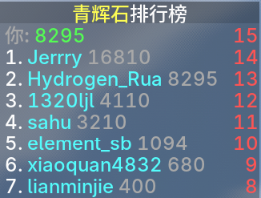
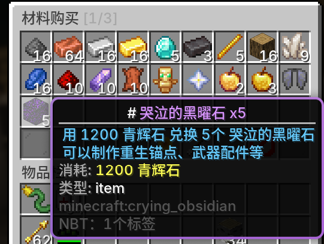
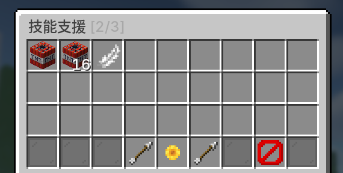
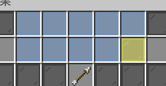
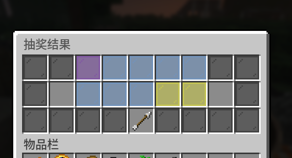
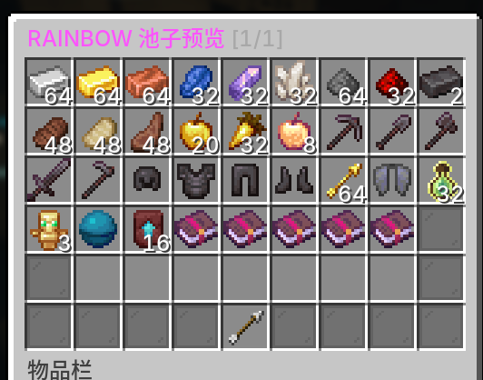
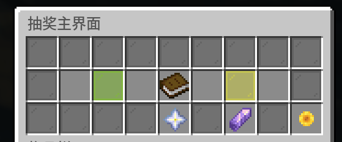
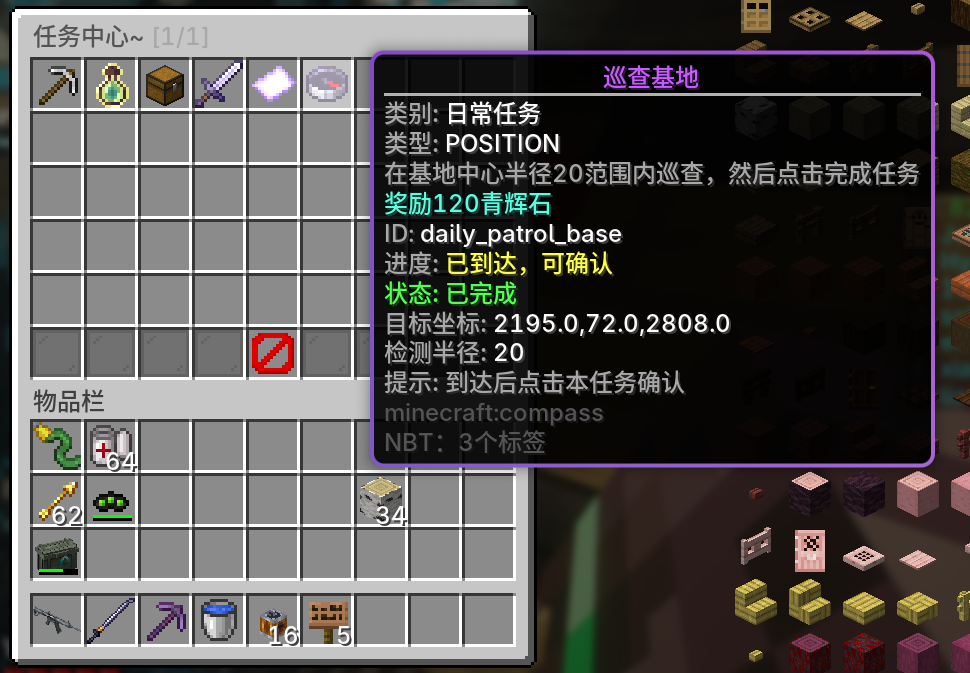

# SiMCUniverse - 模块化多功能MC插件

一个面向生存服的 Spigot 多模块插件（Java 17，1.20.1）。
原作为 **月梦初晓 RisingLight Minecraft 公益服务器** 和 **惠州一中智能信息社/算法AI社** 假期Minecraft服务器活动 玩法插件，现开源向社区开放使用。
感谢前辈的插件 [si-mc-plugin](https://github.com/OneDongua/si-mc-plugin/) 提供的部分玩法参考。

> 设计目标：**模块化、可配置、全能化**。  
> 可以按需启用/禁用模块、独立重载配置，并通过统一管理命令进行运维。

---

## ✨ 设计简介

- 🧩 **模块化架构**：`killscore / livescore / shop / random / checkin / task / protection / quickenhance ...` 各种模块各自独立。
- 🛠️ **统一运维入口**：`/simcuniverse sudo ...` 一站式查看、启停、重载。
- 📁 **配置驱动**：每个模块都有自己的配置目录，支持热重载。

---

## 📖 已开发的模块功能

> 下方为模块简介，可点击该模块标题查看具体的使用方法和示例配置。


### [⚔️ killscore - 击杀加分模块](/wiki/killscore.md)

玩家击杀指定生物加分，分数可以接入商店/抽奖模块。

- 📌 可自定义 `killscore` 分数外显展示名字（别名）
- 📊 可选择是否展示计分板排行榜
- 💬 可开启 ActionBar 加分提示
- ☠️ 可选玩家死亡时是否折算分数以及折算比例



### [❤️ livescore - 生存计分模块](/wiki/livescore.md)

玩家在线时按照配置的时间间隔周期加分，分数可以接入商店/抽奖模块。

- 📋 可选择是否在 Tab 列表展示
- ☠️ 可配置玩家死亡时是否折算分数以及折算比例
- 🏆 可通过命令显示排行

### [🛒 shop - 商店模块](/wiki/shop.md)

十分简单易上手的商店功能，附带GUI，支持详细的商品配置。

- 📋 多页 GUI 商店（`shop/shop_page/Page*.yml`）
- 💱 支持 `killscore` 或 `livescore` 作为货币
- 🧾 可兑换 物品（支持NBT）和 命令执行。
- 🪄 支持手持指定物品右键快捷打开商店（可配置，默认木棍）
- 🔺 可配置商店别名 `/shop`




## [🎰 random - 抽奖模块](/wiki/random.md)

十分简单易配置的抽奖功能，支持单抽和十抽，有GUI，抽奖池分为 `blue` `gold` `rainbow` 三个等级。
灵感来源：Blue Archive

- 💱 支持 `killscore` 或 `livescore` 作为货币
- 🎰 抽奖 GUI（单抽 / 十连）
- 🔥 可配置的保底点数系统 ~~吃井~~
- 🌈 分池权重抽取（`random_pool/*.yml`）
- 🧠 十连规则：第十可配置是否抽仅在 `gold/rainbow` 池抽取 ~~九蓝一金~~
- ~~Arona异地登陆~~





## [📅 checkin - 签到模块](/wiki/checkin.md)

一个有GUI、简单易配置的签到模块，支持配置每日/每周签到任务和是否重复。

- 🔓 支持解锁条件与锁定覆盖
- 🎁 按签到天数发奖励
- 🗂️ 配置文件动态加载（`checkin/checkin_conf/*.yml`）


## [🎫 task -任务模块](/wiki/task.md)

多任务类型、简单易配置的任务模块，附有GUI。

- 🧭 日常/每周/成就任务
- 🧱 支持多任务类型（如击杀、交互、拾取、合成、到达位置等）
- ✅ 支持自动统计与进度显示
- ♻️ 支持按北京时间定时重置



## [🛡️ protection - 保护模块](/wiki/protection.md)

为玩家提供加入保护和重生保护。

## [📚 quickenhance - 快捷附魔模块](/wiki/quickenhance.md)

允许玩家在背包内鼠标拿附魔书，右键目标物品快速附魔，而无需铁砧。

- 🧮 多种经验消耗模型（vanilla / linear / exponential / constant）
- 🚧 可选择消耗上限限制
- 🎨 允许超出原版等级附魔

---

### [🔐 插件模块管理器](/wiki/plugin.md)

插件各个功能使用模块化加载，插件本身命令只作为模块管理器管理各个模块是否加载。

---

## 🚀 快速开始

### 1) 环境要求
- Java 17+
- Spigot/Paper 1.20.1或更高的兼容版本（API 1.20+） 

### 2) 下载预打包jar/本地构建
从GitHub Actions 或者 release 下载jar。
> 注：推荐从release下载 `release` 标签的版本，此类版本通常比较稳定并测试完善。或者下载 Github Actions / release 中 `pre-release` commit 信息里有 `生产环境通过` 的版本。

或者克隆本仓库后，使用maven打包jar。
```bash
mvn clean package
```
构建产物在 `target/` 目录。

### 3) 放入服务器
- 将构建出的 jar 放入 `plugins/`
- 首次启动后会自动生成默认配置

---
## 🧪 开发与反馈

- **AIGC内容提示**：本插件使用了AI辅助代码开发，创意、灵感以及测试则来自于人类。
- **不活跃更新**：作者学业紧张，插件更新不频繁，如有问题/需要新功能推荐fork本仓库后修改源代码。也可以提交issue等作者有时间解决。
- **反馈**：如需要新功能/报告问题，请提Issue。
- **作者并不太了解Java开发。**


---

## ❤️ 致谢

- 感谢前辈的插件：[si-mc-plugin](https://github.com/OneDongua/si-mc-plugin/)

- 插件部分设计及部分示例配置文件采用了 **Blue Archive** 中的一些名词或者设计元素，在此感谢。

- **感谢 点亮Star🌟/支持本项目开发 的你！**

## 许可证
[详见LICENSE文件](/LICENSE)